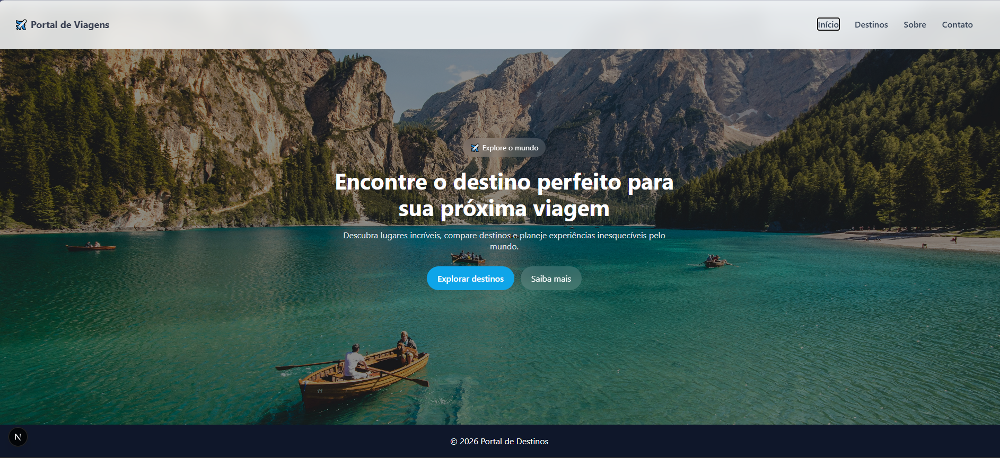
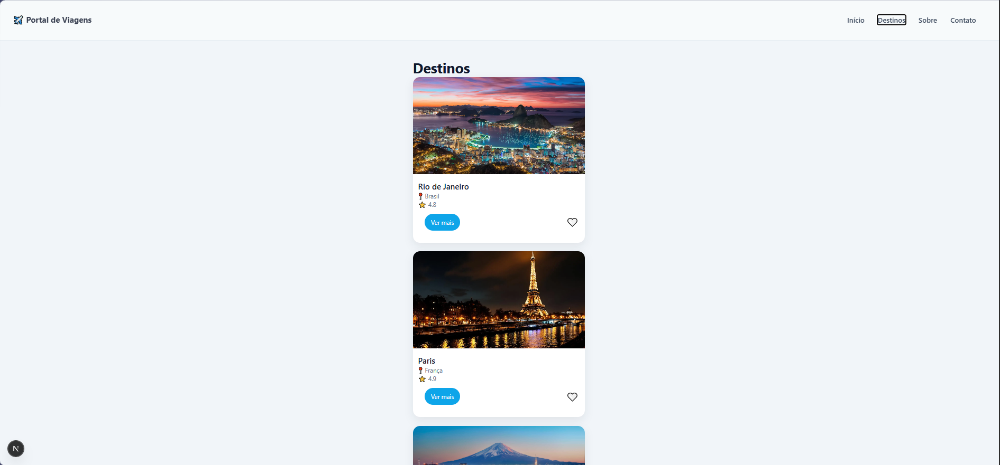
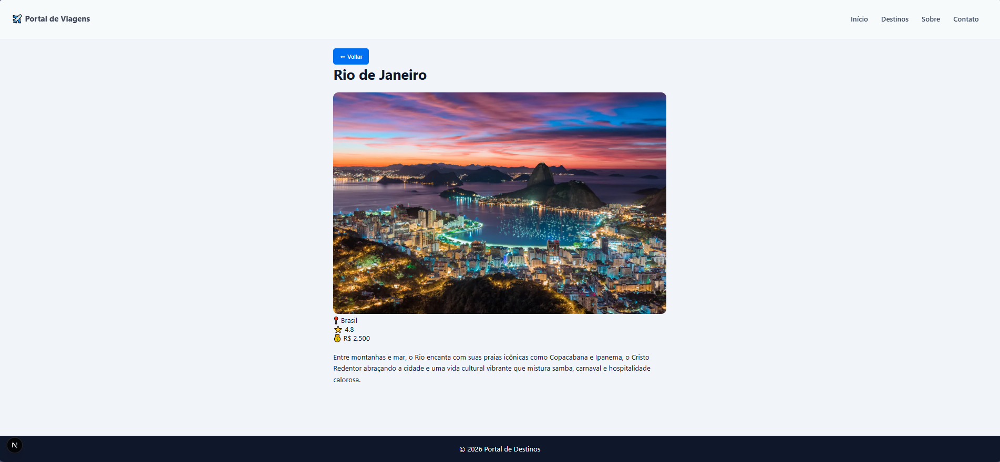

# 🌍 Portal de Viagens

Projeto desenvolvido em **Next.js + TypeScript** durante o curso da EBAC.

O objetivo é criar um portal de viagens moderno e responsivo, aplicando conceitos de **App Router, componentização, rotas dinâmicas e CSS Modules**.

---

## 🚀 Tecnologias

- Next.js (App Router)
- TypeScript
- React
- CSS Modules
- ESLint
- Vercel

---

## 📂 Estrutura do projeto


Portal-de-viagem/
├─ app/
│ ├─ page.tsx
│ ├─ layout.tsx
│ ├─ destinos/
│ │ ├─ page.tsx
│ │ └─ [id]/page.tsx
│ ├─ contato/
│ └─ sobre/
├─ components/
├─ data/
├─ styles/
├─ public/


---

## 🖼️ Preview

Adicione screenshots do projeto aqui:

### Home


### Destinos


### Detalhes


---

## ⚙️ Como rodar o projeto

```bash
git clone https://github.com/CintiaLima-83/Portal-de-viagem.git

cd Portal-de-viagem

npm install

npm run dev

Acesse: http://localhost:3000

🌐 Deploy

👉 https://portal-de-viagem.vercel.app

✨ Funcionalidades
Lista de destinos turísticos
Página de detalhes dinâmica
Layout responsivo
Hero section moderno
Componentização
CSS Modules
👩‍💻 Autora

Cintia Lima
Desenvolvedora em formação pela EBAC.

Foco em Frontend (React, TypeScript, Next.js) e explorando Backend e Cibersegurança.

📚 Contexto

Projeto desenvolvido durante o curso da EBAC aplicando conceitos de desenvolvimento frontend moderno com React e Next.js.
